##Header 2
**_Datum_**
[Link](www.google.com)

## Question 1: First Contact with Snellius (Cluster Access)  
**Used command:** ssh scur2387@snellius.surf.nl
I landed on login node int6.
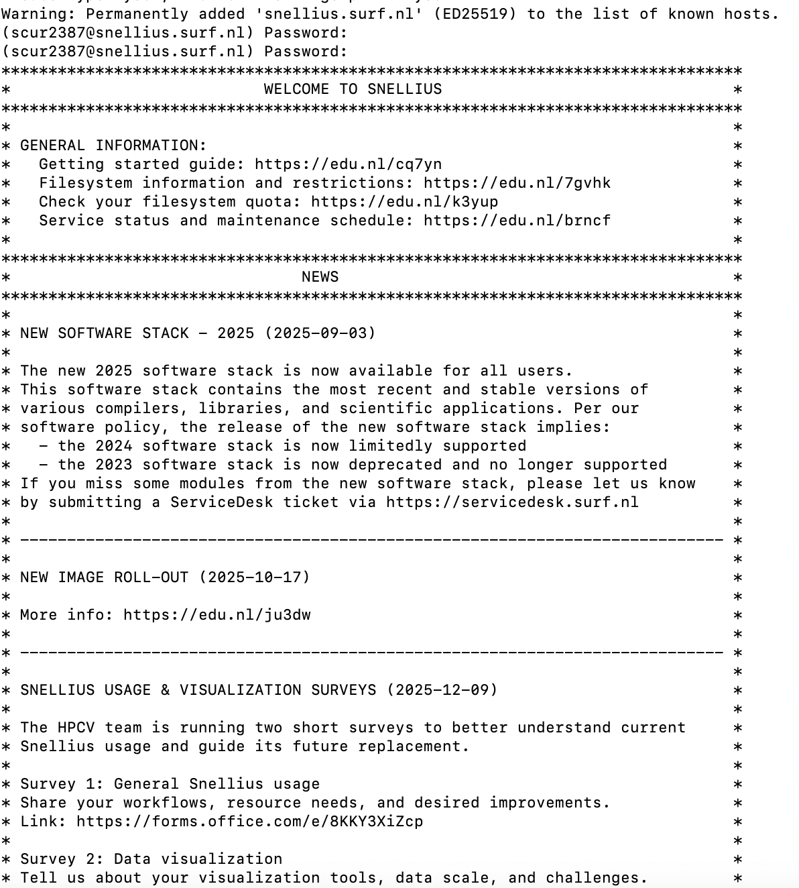

**Issue:** The system asked for a fingerprint. After talking to the TA, I understood that SSH can be used for both: just login onto an external computer - that is the case with me logging in to Snellius - and to obtain a key as an extra security level - which is not the case now. However, in my previous experience with SSH (during website making subject from Year 1), my team did use this approach to provide all team members with access to the website repository. 
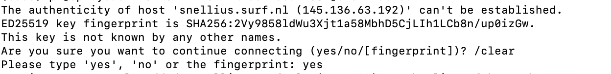
  
    
## Question 2: Environment Setup (Modules & Virtual Environments)  
**Sequence of commands:**
source my_venv/bin/activate  
module list  
module load 2025  
module list  
module load Python/3.13.1-GCCcore-14.2.0  
module list  
module avail matplotlib  
module load  matplotlib/3.10.3-gfbf-2025a  
python -m venv my_venv  
pip install --upgrade pip  
pip install torch  
du -sh my_venv  

**Path to the virtual environment**  
(my_venv) [scur2387@int6 ~]$ realpath my_venv  
/gpfs/home3/scur2387/my_venv

**Installing PyTorch**  
- _How long did the installation take (approximately)?_  
The laptop says around 15-20 seconds, but in reality it took approximately 1-2 min.
- _Did you encounter any warnings about “pip version” or “dependency conflicts”?_  
Certainly! The pip version was old, so I had to upgrade it to a newer one. 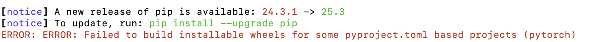
- _What was the size of your venv folder after installation?_  
6.7G	my_venv

**Mistakes**  
One of the mistakes was "import pytorch" instead of "import torch". The library is called torch, so that is why I also used "pip install torch" later.  
Another confusion arised because of CUDA available: False. I was at first scared that my torch was downloaded incorrectly, but I used a CPU at that time, so obviously CUDA would be unavailable.

**PROMPT**  
python -c "import torch; print(f'PyTorch: {torch.__version__}'); print(f'CUDA available: {torch.cuda.is_available()}')"  
PyTorch: 2.9.1+cu128  
CUDA available: False  

2.9.1 is the version of PyTorch. cuda support version 12.8.    
The "CUDA unavailable" output is expected, because my login node is int6 - which is a CPU, not a GPU.

## Question 3
**My GitHub Repository:** https://github.com/polianna-v/MLops.git  
**Authentication Method:** I used SSH key. The mistake that I made was that I mixed up a private and a public key, while adding it to my account on GitHub.  
Another mistake while git push master was that I didn't name my branch "main", the branch had name "master".  
Another minor issue:  
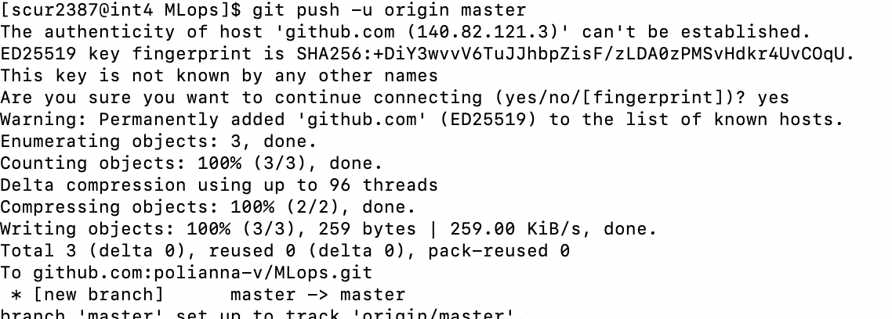 
  
**.gitignore** My .gitignore is empty as of yet.  
• _What are important things to include in the .gitignore?_  
The things to be added are large files (e.g. datasets), so that not the file itself is downloaded, but the link to the file. Also environments to read files.  
• _Should you include information about how to access Snellius and load the necessary software in your README.md?_  
Yes, you should. README.md is a description of the project.  
  
**git log -oneline**  
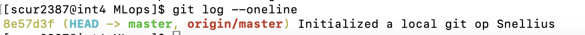   

  
## Question 4
**test.job**  
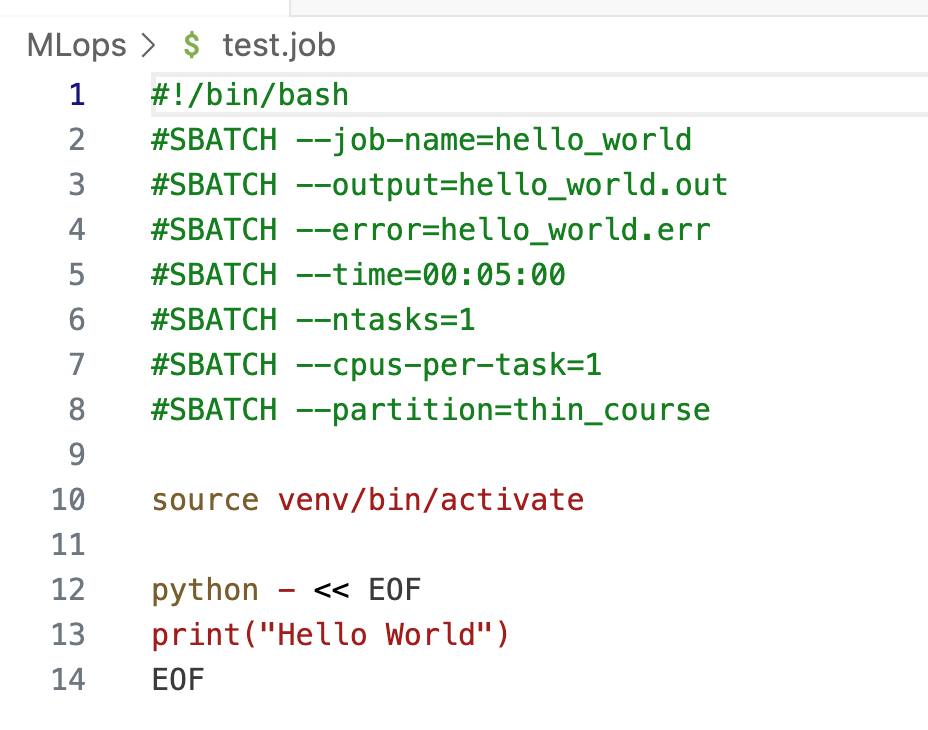    
**Output file**  
   
**Error file**  
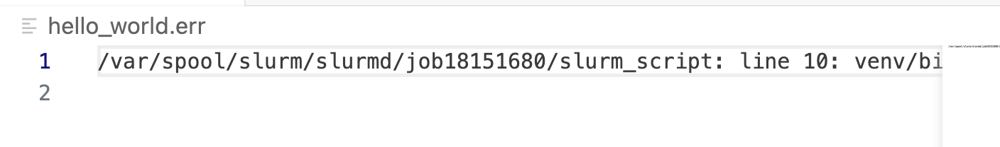   

**Job ID:** 18151680  
**It took:** 0:09 sec

**Job submission:** I encountered no problems. My job run successfully, all the necessary files were made. I monitored the job via "squeue -all".  

**5) Difference:** Login nodes is for short runs, testing code, not for real computations. Login nodes are not strong enough, they don't have enough computing power. The real computations are sent to a compute node (like thin_course) via submitting it as a batch job.  

**Cluster** is more efficient because it runs jobs in parallel and has more computing power and bigger memory.   
  
    
## Question 5  
• _Why would directly storing and dataloading these files for a training run cause performance issues on Snellius?_  
First of all, it works in parallel. Thousands of small files create issues when tasks are solved in parallel.  
     
• _Suggest two different possible strategies to mitigate this problem, and explain why they work._  
First, you can transform 1000 small files into 1 big file.  
Second, you can put the data on local device, instead of using shared storage.  
  
• _Suppose now that this dataset is constantly being modified, datapoints are added and/or subtracted. By now, you know that we can version control our code, but how do we version control datasets? How do you version control dataset that are gigabytes or petabytes in size?_   
That is why you should use paths to datasets, not datasets itselves.  
  
_2) With your current Snellius and ML programming knowledge, list three  specific things that could cause them to get different results, even if they use the exact same code. For each, explain how proper MLOps practices (as described in the handbook) would prevent this issue._  
First, numpy, python, etc. can be of different versions.  
Second, hardware can be less or more powerful.  
Third, the shuffling of the order of the datapoints impacts the output as well.  
  
_3) The handbook explicitly discourages using Conda on Snellius. Explain for the following methods of creating an environment the pros and cons using them on Snellius: astral uv, python venv and conda environments._   
python venv is flexible, astral uv is very efficient and fast, conda is discouraged because it creates a lot of small files and can disrupt the shared file system.  
  
## Question 6  
**Errors** I activated my v_env and run pytest tests/test_imports.py and it turned out that my v_env didn't have pytest package installed, so I had to install it with "pip install pytest". Afterwards the message printed that all requirements were satisfied and that all modules are loaded properly.  
So no, I didn't encounter a ModuleNotFoundError when running this test, because I verified beforehand that every subfolder had a proper init.py in it.  
  
    
**Why is it better practice to import PCAMDataset from ml_core.data rather than importing it directly from the full path ml_core.data.pcam?**  
I think it is better because the code looks cleaner, and it prevents the situation when different versions of the data are downloaded by adjusting the path to it via one link.  

(my_venv) [scur2387@tcn352 ~]$ module load foss/2025a
(my_venv) [scur2387@tcn352 ~]$ module load h5py/3.14.0-foss-2025a
(my_venv) [scur2387@tcn352 ~]$ python -c "import h5py; print(h5py.__version__)"

## Question 7
**1) getitem:** 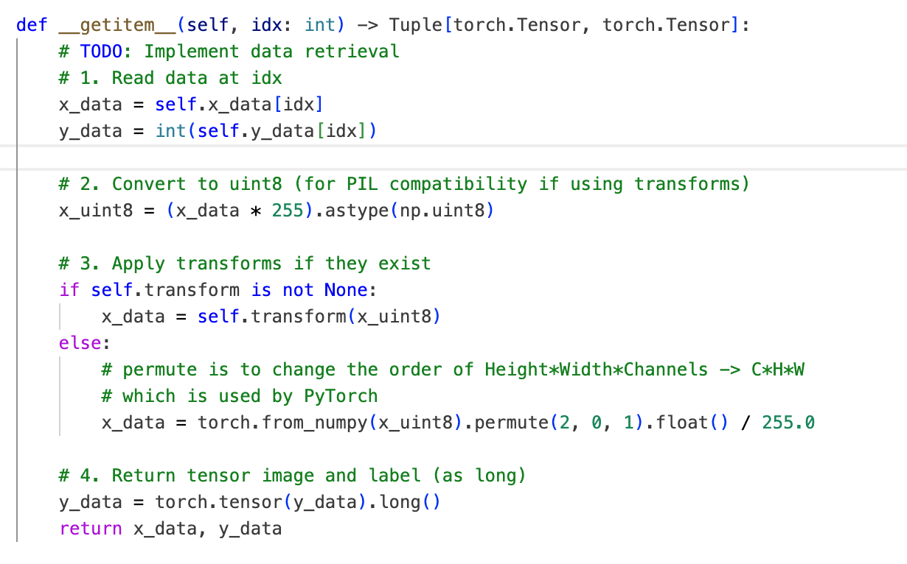   
I converted x_data via torch.from_numpy because it is a huge dataset and i didn't want to copy the data. I clipped the values of x to a range 0-1.  

**Running tests:**  
Initially all tests failed, 1 because of a typo, 1 because I hadn't implemented filtering out outliers.  
Another mistake was that during the implementation of transforms I adjusted the colour of pictures, turning the data into an array instead of a PIL picture. I fixed it by adding: "transforms.Lambda(lambda x: Image.fromarray(x))", that I solved with the help of ChatGPT.
  
Another issue was that my labels/self.y_data was a 4D tensor, while I wanted it to be 1D tensor. I fixed this by changing how the data is read from the file in pcam.py. 
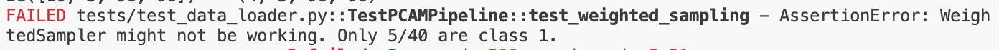  
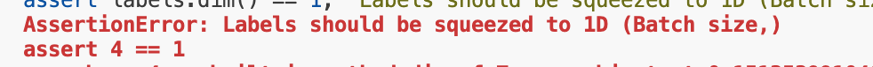  

**MY ACTIONS TAB** doesn't show anything, I will ask a question about that during lab. The CI (Continuous Integration, basically pushing each time after i change code) can fail because, for example, Python versions differ on Snellius and on the system that runs the code on GitHub.  

**Positives:** If batch size is 32, and the dataset is 20% class 1 and 80% class 0, then withoug weightsampler i see 32*20%=6 positives per batch, and with the sampler the classes are evenly probable so 16 positives. 

**I didn't succeed in plotting the data.** First, the problem was that my python and numpy versions were incompatible, or they were used not from my venv, but from default system. I spent an hour tackling that. When I fixed my virtual environment and ran the visualisation script, it just froze.  
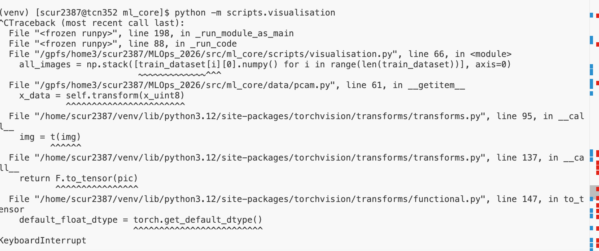  

## Question 8  
**1) Correct input dimension:** I flattened the input so that it meets the requirements for nn.Linear.  
**2) Loss vs weights:** If you only know that loss is a number, you are not sure, whether it changes and whether the network improves itself.  
**3) Successful run**  
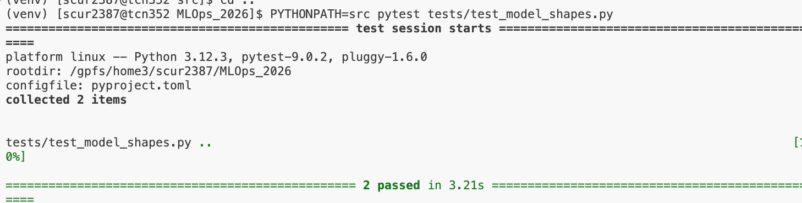  

## Question 9  
I didn't succeed in running the script. I did submit the job as sbatch. At first, I had a problem, that Snellius wouldn't let me submit the job, as I was exceeding the limit of CPU/GPU i could use. After checking my allowed use of Snellius,  
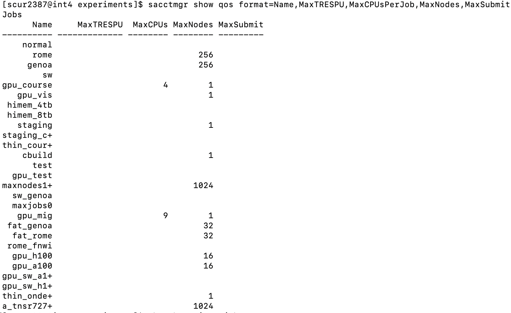   

I adjusted my train.job.  
   
It worked. But it wasn't successful. The logs were recorded, and I got the following error messages:  
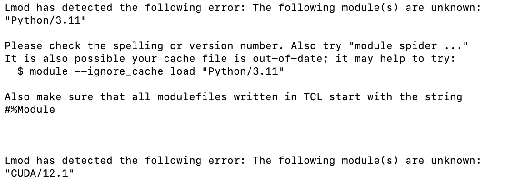  
I don't know what could be the reason, as I checked with python --version and which python, that the python used is from my environment, and all modules in my environment are compatible with each other. The most frustrating error was the CUDA error.  
My unsuccessful job ran on gcn9. 
  